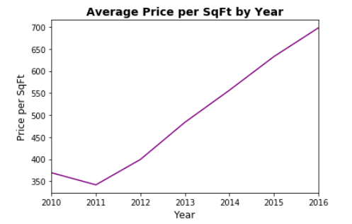
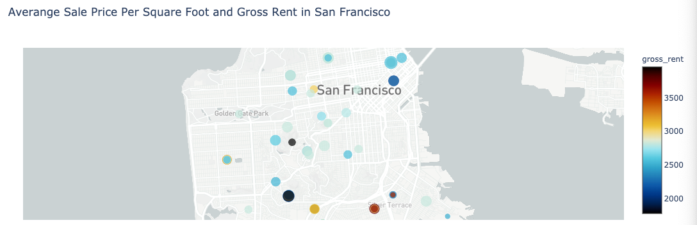

# Real Estate Investment - Rental Analysis


*[San Francisco Park Reading by Juan Salamanca](https://www.pexels.com/photo/park-san-francisco-reading-61109/) | [Free License](https://www.pexels.com/photo-license/)*

## Background

Harold's company has just started a new Real Estate Investment division to provide customers with a broader range of portfolio options. Harold was tasked with building a prototype dashboard. The real estate team wants to trial this initial offering with investment opportunities for the San Francisco market. If the new service is popular, then they can start to expand to other markets.

The goal of this dashboard is to provide charts, maps, and interactive visualizations that help customers explore the data and determine if they want to invest in rental properties in San Francisco.

In this homework assignment, I will be doing the following tasks:

1. [Rental analysis](#Rental-Analysis)

2. [Dashboard of interactive visualizations to explore the market data](#Dashboard)

---

## Packages Used

* Plotly Express
* Hvplot
* Panel - Holoviz (For creating Dashboard)- Interact
* Mapbox Token
* Holoviews extension

> Please note due to some lab extension tech. difficulties, I have imported differently than what has been suggested in the pdf.

## Files

* [sfo_neighborhoods_census_data.csv](Data/sfo_neighborhoods_census_data.csv)
* [neighborhoods_coordinates.csv](Data/neighborhoods_coordinates.csv)
* [Rental Analysis Starter Jupyter Notebook](rental_analysis.ipynb)
* [Dashboard Starter Jupyter Notebook](dashboard.ipynb)


## Rental Analysis

The first step to building the rental analysis is to work out all of the calculations and visualizations in an analysis notebook.  Used the `rental_analysis.ipynb` to complete the following:

#### Housing Units Per Year

Calculate the average number of housing units per year and visualize the results as a bar chart using the Pandas plot function.

1. Calculate the `average number of housing units per year` in San Fransciso

  ```python
    sfo_avg_housing_units = sfo_data.groupby('year')['housing_units'].mean()
    sfo_avg_housing_units.plot.bar()
  ```


Visualization as a Bar chart using Pandas Plot

  


#### Average Gross Rent in San Francisco Per Year

Visualize the average gross rent per year to better understand the trends for rental income over time. You will visualize the average (mean) gross rent per year and visualize it as a line chart.

1. Calculate the mean `gross rent` for each year

  ```python
    sfo_avg_gross_rent = sfo_data[['gross_rent','year']].groupby('year').mean()
    sfo_avg_gross_rent.plot.line()
  ```
  
  
2. Visualization as a Line Chart

  

#### Average Sales Price Per Year

Determine the average sales price per year to better understand the sales price of the rental property over time. For example, a customer will want to know if they should expect an increase or decrease in the property value over time so they can determine how long to hold the rental property. 

1. Calculate the mean `sales_price_sqr_foot` for each year.

    ```python
        sfo_avg_price_sqr_foot = sfo_data[['sale_price_sqr_foot','year']].groupby('year').mean()
        sfo_avg_price_sqr_foot.plot.line()
    ```


2. Visualization as a Line Chart

  

#### Average Prices By Neighborhood

In this section, Compare the average prices by neighborhood.

1. Group the data by year and by neighborhood and calculate the average (mean) `sales_price_sqr_foot`.

    ```python
        sfo_average_df = sfo_data.groupby(['year','neighborhood']).mean()
        sfo_average_df.hvplot()
    ```
    
    
2. Visualize with the neighborhood as a dropdown selector

  

#### Top 10 Most Expensive Neighborhoods

1. Calculate the mean sale price for each neighborhood and then sort the values to obtain the top 10 most expensive neighborhoods on average. Plot the results as a bar chart.

   ```python
   sfo_top10 = sfo_data.groupby(['neighborhood'])['sale_price_sqr_foot'].mean().sort_values(ascending=False).head(10)
   sfo_top10.hvplot()
   ```
    
2. Visualization as a Bar Chart

  
  

#### Parallel Coordinates and Parallel Categories Analysis

Use plotly express to create parallel coordinates and parallel categories visualizations so that investors can interactively filter and explore various factors related to the sales price of the neighborhoods.

Using the DataFrame of Average values per neighborhood (calculated above), created the following visualizations:

1. Parallel Coordinates Plot

  

2. Parallel Categories Plot

  

#### Neighborhood Map

Using Scatter Mapbox object from plotly express, Geographical visualization of the neighborhood location data and information about the average prices per neighborhood.

  

## Dashboard

Now that we have worked out all of the code and analysis, We will use the Panel library to build an interactive dashboard for all of the visualizations in `Dashboard.ipynb`. 

   ```

  


    
- - -
